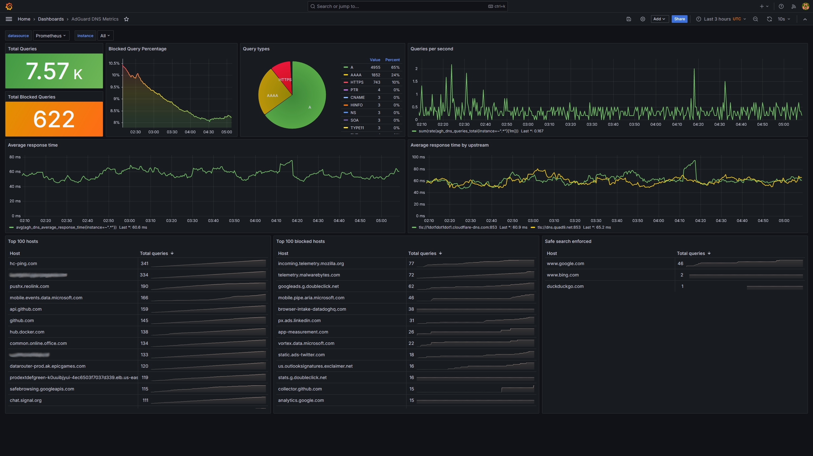

# Overview

<p>This exporter is primarily intended to run as a sidecar container for AdGuard Home running in Kubernetes, enabling metrics visibility across multiple replica instances. It works by mounting to AdGuard's work directory and reading lines from querylog.json, as demonstrated in the deployment example below. The exporter is written in Go and uses a distroless image running as nonroot to align with container best-practices.</p>

[](https://grafana.com/grafana/dashboards/21403)

# Available metrics:
```
agh_dns_queries_total: Total number of DNS queries
agh_blocked_dns_queries_total: Total number of blocked DNS queries
agh_dns_query_types_total: DNS query types and respective counts
agh_dns_query_hosts_total: Top 100 DNS query hosts
agh_blocked_dns_query_hosts_total: Top 100 blocked DNS query hosts
agh_safe_search_enforced_hosts_total: Safe search enforced hosts
agh_dns_average_response_time: Average response time of all queries in ms
agh_dns_average_upstream_response_time: Average response time of upstream servers in ms
```

# How to use this container.

<p>Ensure that Adguard is configured to dump query log to file at regular interval using low `size_memory` setting. This example will cause queries to be logged every 5 lines:</p>

### secret.yaml
```yaml
apiVersion: v1
kind: Secret
metadata:
  name: adguard-secret
  namespace: adguard
type: Opaque
stringData:
  AdGuardHome.yaml: |
    # ... [earlier configuration omitted]

    querylog:
      dir_path: ""
      ignored:
        - localhost
      interval: 24h
      size_memory: 5
      enabled: true
      file_enabled: true

    # ... [remaining configuration omitted]
```

<p>Add the sholdee/adguardexporter sidecar container to your existing Adguard deployment manifest.</p>

### deployment.yaml
```yaml
apiVersion: apps/v1
kind: Deployment
metadata:
  name: &app adguard
  namespace: *app
spec:
  replicas: 3
  strategy:
    type: RollingUpdate
  selector:
    matchLabels:
      app: *app
  template:
    metadata:
      labels:
        app: *app
    spec:
      securityContext:
        runAsNonRoot: true
        runAsUser: 65532
        runAsGroup: 65532
        fsGroup: 65532
        seccompProfile:
          type: RuntimeDefault
      topologySpreadConstraints:
      - maxSkew: 1
        topologyKey: kubernetes.io/hostname
        whenUnsatisfiable: DoNotSchedule
        labelSelector:
          matchLabels:
            app: *app
      initContainers:
      - name: adguard-init
        image: busybox:1.36.1
        securityContext:
          capabilities:
            drop:
            - ALL
          readOnlyRootFilesystem: true
          runAsNonRoot: true
          runAsUser: 65532
          runAsGroup: 65532
          allowPrivilegeEscalation: false
        imagePullPolicy: IfNotPresent
        command: ["sh", "-c", "cp /home/AdGuardHome.yaml /config/AdGuardHome.yaml; chmod 644 /config/AdGuardHome.yaml"]
        volumeMounts:
          - mountPath: /home
            name: adguard-secret
          - mountPath: /config
            name: adguard-conf
      containers:
      - name: adguard-home
        image: adguard/adguardhome:v0.107.52
        securityContext:
          capabilities:
            drop:
            - ALL
            add:
            - NET_BIND_SERVICE
          readOnlyRootFilesystem: true
          runAsNonRoot: true
          runAsUser: 65532
          runAsGroup: 65532
          allowPrivilegeEscalation: false
        imagePullPolicy: IfNotPresent
        ports:
        - containerPort: 53
          name: dns
          protocol: UDP
        - containerPort: 53
          name: dnstcp
          protocol: TCP
        - containerPort: 3000
          name: http-initial
          protocol: TCP
        - containerPort: 80
          name: http
          protocol: TCP
        volumeMounts:
        - name: adguard-data
          mountPath: /opt/adguardhome/work
        - name: adguard-conf
          mountPath: /opt/adguardhome/conf
        resources:
          requests:
            memory: 150Mi
            cpu: "15m"
          limits:
            memory: 400Mi
        livenessProbe: &probe
          exec:
            command:
            - /bin/sh
            - -c
            - nslookup localhost 127.0.0.1
        readinessProbe: *probe
      - name: adguard-exporter
        image: ghcr.io/sholdee/adguard-exporter:v2.0.2
        securityContext:
          capabilities:
            drop:
            - ALL
          readOnlyRootFilesystem: true
          runAsNonRoot: true
          runAsUser: 65532
          runAsGroup: 65532
          allowPrivilegeEscalation: false
        imagePullPolicy: IfNotPresent
        ports:
        - containerPort: 8000
          name: metrics
          protocol: TCP
        volumeMounts:
        - name: adguard-data
          mountPath: /opt/adguardhome/work
        livenessProbe:
          httpGet:
            path: /livez
            port: metrics
        readinessProbe:
          httpGet:
            path: /readyz
            port: metrics
      volumes:
      - emptyDir: {}
        name: adguard-data
      - emptyDir: {}
        name: adguard-conf
      - name: adguard-secret
        secret:
          secretName: adguard-secret
```

<p>Add metrics port to service definition</p>

### service.yaml
```yaml
apiVersion: v1
kind: Service
metadata:
  name: adguard-http
  namespace: adguard
  labels:
    app: adguard
spec:
  selector:
    app: adguard
  ports:
  - protocol: TCP
    port: 80
    targetPort: 80
    name: http
  - port: 8000
    protocol: TCP
    targetPort: 8000
    name: metrics
  type: ClusterIP
```

<p>Create a service monitor for Prometheus to start scraping metrics.</p>

### servicemonitor.yaml
```yaml
apiVersion: monitoring.coreos.com/v1
kind: ServiceMonitor
metadata:
  name: adguard-metrics
  namespace: adguard
  labels:
    app: adguard
spec:
  selector:
    matchLabels:
      app: adguard
  namespaceSelector:
    matchNames:
    - adguard
  endpoints:
  - port: metrics
    interval: 30s
    path: /metrics
```
